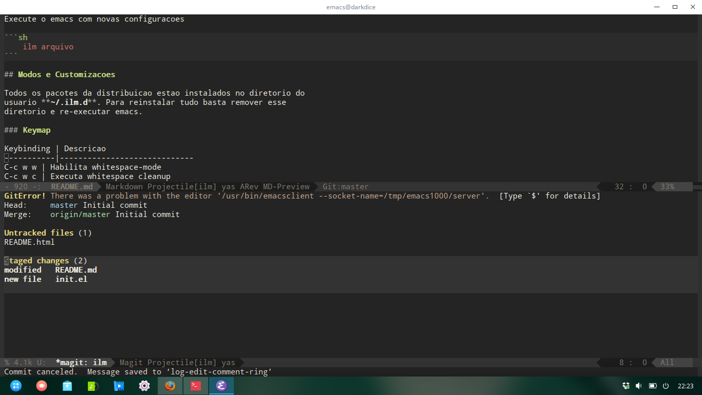

# ilm - distribuicao emacs minima

Minhas configuracoes pessoais do emacs. Distribuicao minima com tema
escuro.



## Uso

Baixe o repositorio no diretorio ilm

```bash
	git clone https://github.com/ildenir/ilm.git ilm
	alias ilm='emacs -l ~/ilm/init.el'
```

Execute o emacs com novas configuracoes

```bash
	ilm arquivo
```

## Modos e Customizacoes

Todos os pacotes da distribuicao estao instalados no diretorio do
usuario `~/.ilm.d`. Para reinstalar tudo basta remover esse
diretorio e re-executar emacs.

### Keymap

Keybinding | Descricao
-----------|-----------------------------
C-c w w | Habilita whitespace-mode
C-c w c | Executa whitespace cleanup
C-x G   | Magit status


## Distros mais completas
 * [Emacs Prelude](https://github.com/bbatsov/prelude) : distribuicao para Emacs 24
 * [Spacemacs](https://github.com/syl20bnr/spacemacs)  : distribuicao ux baseada no vim
